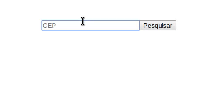

react-via-cep
=======

[](https://badge.fury.io/js/react-via-cep)
[](https://www.npmjs.com/package/react-via-cep)


integração simples para https://viacep.com.br

<p align="center">
	<br>
	
	<br>
</p>

## Instalação
Instalar via npm:
```
npm i --save react-via-cep
```
Instalar via yarn:
```
yarn add react-via-cep
```
## Docs

Component API.

| Nome | Tipo    | Padrão  | Descriçãos                                                                                                  |
|------------|-----------|---------|-----------------------------------------------------------------------------------------------------|
| cep        | String    |         | Formato do cep 00000-000 ou 00000000                                                                |
| onSuccess  | function  |         | Função executada caso o cep seja encontrado que recebe como paramento um objeto com os dados do cep |
| lazy       | Boolean   | false   | Aguardar a função fetch ser disparada para carregar os dados. Nesse caso o cep deve ser válido      |

## Exemplo de uso simples.

```jsx
import ViaCep from 'react-via-cep';

<ViaCep cep={this.state.cep} lazy>
  { ({ data, loading, error, fetch }) => {
    if (loading) {
      return <p>loading...</p>
    }
    if (error) {
      return <p>error</p>
    }
    if (data) {
      return <div>
        <p>
          CEP: {data.cep} <br/>
          CIDADE: {data.localidade} <br/>
          UF: {data.uf} <br/>
        </p>
      </div>
    }
    return <div>
      <input onChange={this.handleChangeCep} value={this.state.cep} placeholder="CEP" type="text"/>
      <button onClick={fetch}>Pesquisar</button>
    </div>
  }}
</ViaCep>
```
## Dados retornados

```
{
  "cep": "01001-000",
  "logradouro": "Praça da Sé",
  "complemento": "lado ímpar",
  "bairro": "Sé",
  "localidade": "São Paulo",
  "uf": "SP",
  "unidade": "",
  "ibge": "3550308",
  "gia": "1004"
}
```
## License
MIT &copy; [Arthur Ribeiro](https://github.com/devarthurribeiro)
